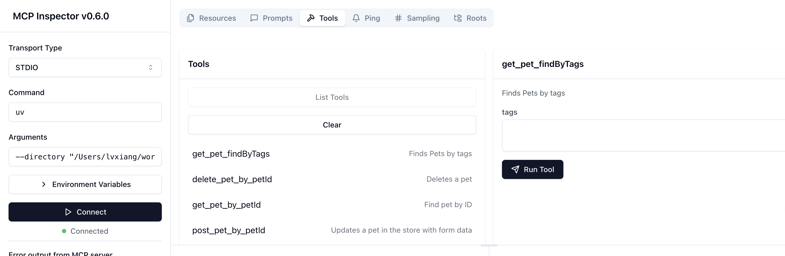

# MCP 生成器(WIP)

_此项目正在开发中，尚未完成。_

`ai-create-mcp` 是一个基于 Go 开发的工具，用于将 OpenAPI 规范 (OAS) 文件转换为模型上下文协议 (MCP) 程序。它提供了一种简单高效的方法，可以从 OAS 文件生成符合 MCP 协议的代码或配置，并支持项目设置和集成的自定义选项。

**[English](README.md)**

## 功能

- 将 OAS 文件转换为 MCP 协议。
- 可自定义项目名称、目录和版本。
- 可选的 Claude.app 集成。
- 提供调试和分析的检查器工具。

## 安装

要安装 `ai-create-mcp`，请确保您的系统已安装 Go。然后运行以下命令：

```bash
go install github.com/xxlv/ai-create-mcp
```

或者，克隆仓库并手动构建：

```bash
git clone https://github.com/xxlv/ai-create-mcp.git
cd ai-create-mcp
go build
```

## 使用方法

该工具通过命令行标志进行配置。以下是可用标志及其描述：

| 标志           | 类型   | 默认值         | 描述                      |
| -------------- | ------ | -------------- | ------------------------- |
| `-path`        | string | `""`           | 创建项目的目录            |
| `-name`        | string | `""`           | 项目名称                  |
| `-oaspath`     | string | `""`           | OAS 文件路径              |
| `-version`     | string | `"0.1.0"`      | 服务器版本                |
| `-inspector`   | bool   | `true`         | 启用/禁用检查器工具       |
| `-description` | string | `"Simple mcp"` | 项目描述                  |
| `-claudeapp`   | bool   | `true`         | 启用/禁用 Claude.app 集成 |
| `-autoyes`     | bool   | `true`         | 启用/禁用自动确认         |

### 示例

要从 OAS 文件生成 MCP 项目，请运行：

```bash
ai-create-mcp -path ./myproject -name my-mcp-app -oaspath ./openapi.yaml -version 1.0.0
```

此命令将：

- 在 `./myproject` 目录中创建项目。
- 将项目命名为 `my-mcp-app`。
- 使用位于 `./openapi.yaml` 的 OAS 文件。
- 将服务器版本设置为 `1.0.0`。

> `./testdata/openapi.yml` 将转化成如下工具🔧



要禁用检查器和 Claude.app 集成，请使用：

```bash
ai-create-mcp -path ./myproject -name my-mcp-app -oaspath ./openapi.yaml -inspector=false -claudeapp=false
```

要启用完全自动运行（无提示），请使用 `-autoyes`：

```bash
ai-create-mcp -path ./myproject -name my-mcp-app -oaspath ./openapi.yaml -autoyes
```

## 配置

该工具依赖于提供的命令行标志进行配置。请确保：

- `-oaspath` 指向有效的 OAS 文件（例如 `.yaml` 或 `.json`）。
- `-path` 目录具有写权限。
- `-name` 符合您用例的命名规范。

## 贡献

欢迎贡献！要参与贡献：

1. Fork 本仓库。
2. 创建一个新分支（`git checkout -b feature/your-feature`）。
3. 进行更改并提交（`git commit -m "添加您的功能"`）。
4. 推送到分支（`git push origin feature/your-feature`）。
5. 提交一个 Pull Request。

## 许可证

本项目采用 MIT 许可证授权。详情请参见 [LICENSE](LICENSE) 文件。
